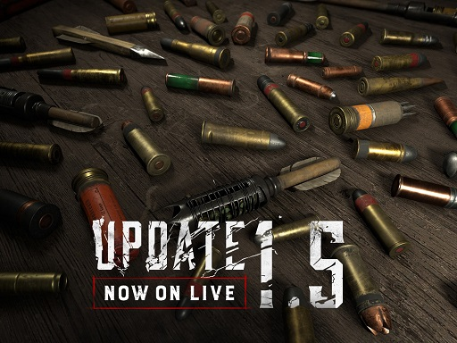
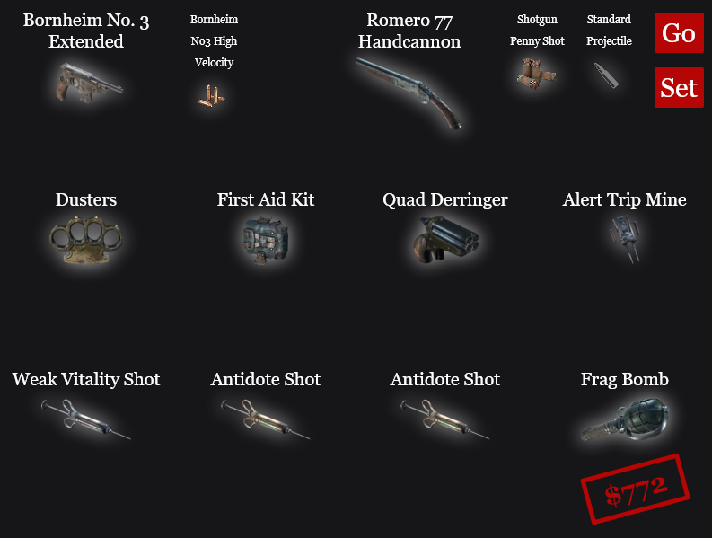
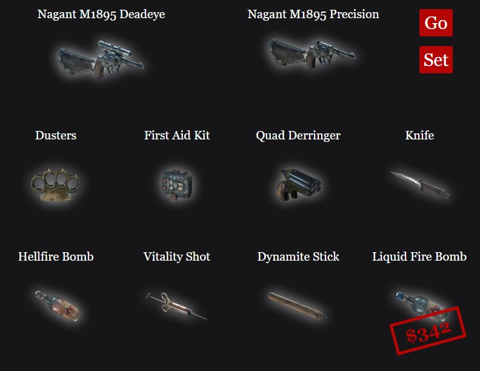
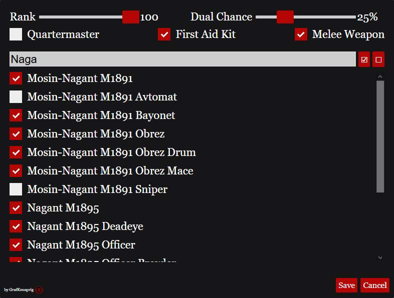

# HuntShowdownLoadoutRandomizer

### v1.3 Custom Ammunition

<p float="left">


</p>

With **Hunt: Showdown Patch 1.5** Custom Ammunition was introduced to the game.

Single shot weapons and crossbows can use 2 ammo types at once.
Weapons with a magazine can only use one type.
There are different types for each weapon.

The **HuntShowdownLoadoutRandomizer** now adds this feature to the loadout generator.
Thus, in addition to the standard ammunition, you can also use the new ammunition types.

```diff
! Don'T forget to clear your browser cache after updating! ;)
```

### v1.2 First Release

<p float="left">


</p>

**HuntShowdownLoadoutRandomizer** is a local browser application that generates random loadouts for the game Hunt: Showdown.
It is perfectly suited to be used as a browser plugin in OBS-Studio and similar applications and was made exactly for this purpose.

### Usage in OBS:
1. Download all files and store them in a local folder on your PC. (Download as .zip and unpack)
2. Add **Randomizer.html** as a **Browser** source with a local file to your scene in OBS.
It has been designed to work with the default resolution for browser resources in OBS of 800px x 600px or larger. 

To interact with the **Randomizer** in OBS, right-click on the **Browser** source and select *Interact*.

As default, OBS includes a custom CSS in all browser sources which looks as follows:

```body { background-color: rgba(0, 0, 0, 0); margin: 0px auto; overflow: hidden; }```

You can remove this line if you don't want the background of the randomizer to be transparent. Or add any other color, if you like.


### Using the Randomizer:
- **Go** - generates a random loadout based on the settings made.
- **Set** - in the settings menu you can make a selection about the items you want to generate. These can be filtered via the rank and the search line to ensure a quick search.
- **Rank** - the filter setting for the rank. Filters the item list to all possible items you can have in this rank.
- **Dual Chance** - this is the probability in percent that pistols will be equipped as dual weapons, if the loadout allows it.

+ **Quartermaster** - sets whether you have the Quartermaster Trait.
+ **First Aid Kit** - always includes a First Aid Kit in the tool selection.
+ **Melee Weapon** - always includes a melee weapon in the tool selection.


Have fun with the little program. If you find any bugs, please let me know on GitHub.
https://github.com/GrafKnusprig/HuntShowdownLoadoutRandomizer

If you feel like it, you can also drop by on twitch.
https://www.twitch.tv/grafknusprig

Watch the instruction video on YouTube:
https://www.youtube.com/watch?v=yLbF4_L7gus

Your GrafKnusprig.