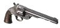

# HuntShowdownLoadoutRandomizer

**Try it out online:**

https://grafknusprig.github.io/HuntShowdownLoadoutRandomizer/Randomizer.html

<ins><b>Don't forget to clear your browser cache after updating! (Ctrl + F5) 🙂</b></ins>

---

### v1.4.0 Price Limit
*2021/10/19*

#### New Option **Price Limit**


Set a limit on how much hunt dollars you want to spend for your loadout.
The randomizer tries not to hit the price as much as possible, but to stay below it.

The pricetag is green if the loadout lands more than 10% below the limit, yellow if it's in the 10% and
red if it couldn't keep the limit.

#### Roadmap:

- Adding an option to avoid multiple melee tools

---

### v1.3.3 Patch
*2021/10/17*


Added pricing changes, new ammunition and weapons, that came with Hunt: Showdown Patch 1.6.2

- Added Vetterli 77 Karabiner Silencer 
- Added Vetterli 77 Karabiner Marksman 
- Added Vetterli 77 Karabiner High Velocity 
- Added Scottfield Model 3 and ammo variants 
- Added Hunting Bow and ammo variants 
- Added Throwing Axes 
- Added Lebel 1886 Aperture 
- Shotgun ammo changes
- Every ammo can now be selected sepereately in the settings
    - Winfield 1873 / Winfield 1873C / Shotguns / Nagant M1895 / Nagant M1895 Officer / ...
- Renamed weapons and ammo to match their names in game

---

### v1.3.2 Patch

Added pricing changes, new ammunition and weapons, that came with Hunt: Showdown Patch 1.5.2

- Added Winfield Centennial Sniper
- Added Uppercut Explosive Ammo
- Added Pennyshot for Caldwell Rival variants and Specter variants
- Added Slug for Terminus variants and Crown & King
- Changed pricing for the Centennial and Slug Ammo

---

### v1.3.1 Patch

#### Fixed bugs:

- Fixed a bug where the constellation of weapons could be wrong, if less than 5 weapons are selected in the settings.
- Fixed a bug where second custom ammo of primary weapon was not shown.
- Fixed a bug where custom ammo was only available at rank 100.
- Fixed a bug with primary weapons styling.
- Fixed a bug where an exception occured when meele weapon was forced but none was selected.
- Fixed spelling for Caldwell Conversion Uppercut.

#### Known issues:

- none

---

### v1.3 Custom Ammunition

<p float="left">


</p>

With **Hunt: Showdown Patch 1.5** Custom Ammunition was introduced to the game.

Single shot weapons and crossbows can use 2 ammo types at once.
Weapons with a magazine can only use one type.
There are different types for each weapon.

The **HuntShowdownLoadoutRandomizer** now adds this feature to the loadout generator.
Thus, in addition to the standard ammunition, you can also use the new ammunition types.

#### Known issues:
- The rank option is not working with custom ammo yet. (use rank 100)
- The constellation of weapons can be wrong if less than 5 weapons are selected in the settings.

---

### v1.2 First Release

<p float="left">


</p>

**HuntShowdownLoadoutRandomizer** is a local browser application that generates random loadouts for the game Hunt: Showdown.
It is perfectly suited to be used as a browser plugin in OBS-Studio and similar applications and was made exactly for this purpose.

---

## Usage in OBS:
1. Download all files and store them in a local folder on your PC. (Download as .zip and unpack)
2. Add **Randomizer.html** as a **Browser** source with a local file to your scene in OBS.
It has been designed to work with the default resolution for browser resources in OBS of 800px x 600px or larger. 

To interact with the **Randomizer** in OBS, right-click on the **Browser** source and select *Interact*.

As default, OBS includes a custom CSS in all browser sources which looks as follows:

```body { background-color: rgba(0, 0, 0, 0); margin: 0px auto; overflow: hidden; }```

You can remove this line if you don't want the background of the randomizer to be transparent. Or add any other color, if you like.


## Using the Randomizer:
- **Go** - generates a random loadout based on the settings made.
- **Set** - in the settings menu you can make a selection about the items you want to generate. These can be filtered via the rank and the search line to ensure a quick search.
- **Rank** - the filter setting for the rank. Filters the item list to all possible items you can have in this rank.
- **Dual Chance** - this is the probability in percent that pistols will be equipped as dual weapons, if the loadout allows it.
- **Quartermaster** - sets whether you have the Quartermaster Trait.
- **First Aid Kit** - always includes a First Aid Kit in the tool selection.
- **Melee Weapon** - always includes a melee weapon in the tool selection.

---

Have fun with the little program. If you find any bugs, please let me know on GitHub.
https://github.com/GrafKnusprig/HuntShowdownLoadoutRandomizer

If you feel like it, you can also drop by on twitch.
https://www.twitch.tv/grafknusprig

Watch the instruction video on YouTube:
https://www.youtube.com/watch?v=yLbF4_L7gus

Your GrafKnusprig.